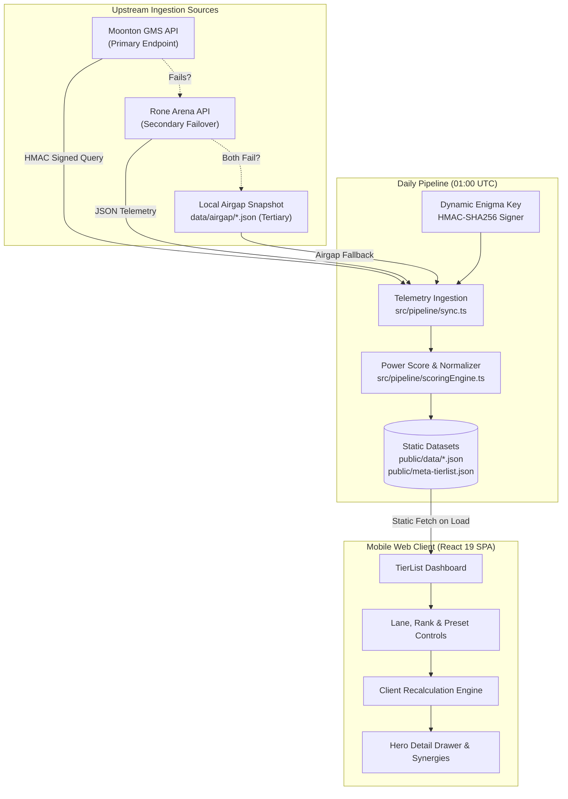

# MLBB Hero Tier List

> Ultra-fast, zero-latency mobile hero tier list backed directly by official Moonton telemetry, designed for high-stakes ranked drafting in Mobile Legends: Bang Bang.

[](https://www.typescriptlang.org/)
[](https://react.dev/)
[](https://vite.dev/)
[](https://tailwindcss.com/)
[](https://vitest.dev/)
[](https://nodejs.org/)

---

## Tech Stack

| Area | Technology | Purpose & Evidence |
| :--- | :--- | :--- |
| **Frontend Framework** | React 19 (`react`, `react-dom` 19.3) | Component-driven mobile SPA rendering within 360px–420px viewports |
| **Build & Dev Tool** | Vite 8 (`vite` 8.3, `@vitejs/plugin-react`) | Rapid HMR and static production asset bundling |
| **Language** | TypeScript (`typescript` 7.0) | Strict end-to-end typing across telemetry and UI contracts |
| **Styling & Typography** | Tailwind CSS 3 & Geist (`geist` 1.7) | Dark Cyber Linear-minimalist design system with high-contrast tier tokens |
| **Ingestion Pipeline** | Node.js (v22 target) | Native execution via `--experimental-strip-types` and HMAC SHA-256 GMS signer |
| **Testing** | Vitest 5 & Node Test Runner | Vitest for UI components; Node native `--test` for scoring and failover pipelines |
| **Automation** | GitHub Actions | Daily scheduled ingestion (01:00 UTC) with gzip bundle size budget check (<50KB) |

---

## Overview

Competitive Mobile Legends: Bang Bang (MLBB) players face a strict 30-second countdown during the draft-pick phase to select optimal heroes, counter opposing picks, and evaluate team synergy. Most community tier lists suffer from subjective bias, slow ad-heavy mobile interfaces, or stale data updated only once per patch.

**MLBB Hero Tier List** is an open-source, mobile-first Web SPA engineered specifically for active draft use. It ingests daily telemetry from Moonton's Game Management System (GMS), computes an unskewed **Composite Power Score** across Win Rate, Pick Rate, and Ban Rate, and exposes verified pairwise synergy deltas (`increase_win_rate`).

### Core Architectural Invariants

* **Client Isolation**: The browser client **never** queries `api.gms.moontontech.com` or third-party APIs directly. All data is pre-compiled at build time into static JSON datasets.
* **Offline & Zero-Latency**: All scoring recalculations, filtering, and synergy inspections occur in-memory without runtime network latency.
* **Data Freshness Disclosure**: Every view explicitly surfaces the UTC generation timestamp of the active dataset.

---

## Features

* **Composite Power Score Formula**: Ranks all heroes into six discrete buckets (`S+`, `S`, `A`, `B`, `C`, `D`) based on Min-Max normalized metrics:
  $$\text{PowerScore} = (0.50 \times \text{NormWR} + 0.25 \times \text{NormPR} + 0.25 \times \text{NormBR}) \times 100$$
* **Niche Pick Dampening**: Heroes with a Pick Rate $< 0.5\%$ are automatically barred from S+ Tier and capped at B Tier to prevent low-sample outliers from skewing rankings.
* **Six Lane Classifications**: Dedicated tabs for `All`, `Gold Lane`, `EXP Lane`, `Mid Lane`, `Roam`, and `Jungle` with canonical flex-pick inclusion (heroes appearing in multiple viable lanes).
* **Multi-Rank & Window Filters**: Seamless switching between Mythic (default competitive ranking), All Ranks, Epic, Legend, Mythical Honor, and Mythical Glory+, across 1-day, 3-day, 7-day, 15-day, and 30-day windows.
* **Hero Detail Drawer**: Bottom-sheet drawer revealing exact Win/Pick/Ban percentages, lane roles, and the Top 3 synergistic partner heroes based on real match telemetry.
* **Client-Side Weight Customization**: Interactive sliders and preset profiles (*Balanced Default*, *Pure Win Rate*, *Ban Priority / Tournament*, *High Popularity*) with instant in-memory recalculation.
* **Instant Hero Search**: Debounced search input optimized for one-handed thumb navigation.

---

## Architecture

The system uses a 3-tier resilient ingestion pipeline feeding static JSON artifacts directly into a client-isolated React application:



### Ingestion & Serving Lifecycle

1. **Daily Cron Trigger**: GitHub Actions runs daily at 01:00 UTC (1 hour following Moonton's 00:00 UTC daily data recalculation).
2. **Resilient Fetch**: The pipeline requests an HMAC signature using Moonton's dynamic Enigma handshake. If Moonton GMS is unreachable, it automatically fails over to Rone Arena API, then to the local airgap snapshots.
3. **Static Generation**: Telemetry is normalized, baseline Power Scores are computed, and static JSON bundles are written to `public/data/` and `public/meta-tierlist.json`.
4. **Client Delivery**: The user's mobile browser loads pre-rendered assets. Dynamic weight slider changes re-normalize metrics purely in-memory using local data.

---

## Getting Started

### Prerequisites

* **Node.js**: $\ge 22.0.0$ (Required for native `--experimental-strip-types` and `--test` support)
* **npm**: $\ge 10.0.0$

### Installation

Clone the repository and install project dependencies:

```bash
git clone https://github.com/bonje-manza/mlbb-tierlist.git
cd mlbb-tierlist
npm install
```

### Configuration

No API keys, access tokens, or private secrets are required. Ingestion endpoints use public handshakes with dynamic Enigma cryptographic signing implemented directly in [`src/pipeline/signer.ts`](src/pipeline/signer.ts).

### Running Locally

Start the Vite local development server:

```bash
npm run dev
```

Open [http://localhost:5173](http://localhost:5173) in your browser. Use your browser developer tools to simulate a mobile viewport (e.g. 390×844 iPhone 14 or 412×915 Pixel 7).

### Syncing Telemetry Manually

To fetch fresh upstream match telemetry and recompile the local static datasets:

```bash
npm run sync
```

---

## Project Structure

```
mlbb-tierlist/
├── .github/workflows/          # Automated daily ingestion & build workflow
│   └── update-tierlist.yml     # Cron schedule at 01:00 UTC with bundle check
├── data/
│   └── airgap/                 # Offline fallback JSON snapshots (tertiary failover)
├── docs/
│   └── adr/                    # Architecture Decision Records (ADRs 0001–0005)
├── public/
│   ├── data/                   # Generated multi-rank & multi-window datasets
│   └── meta-tierlist.json      # Baseline pre-compiled Mythic tier list
├── scripts/
│   └── check-bundle-size.mjs   # Gzip bundle gate (<50KB production budget)
├── src/
│   ├── components/             # React UI components (Dashboard, Tiles, Drawer, Carousel)
│   ├── pipeline/               # Ingestion, Enigma HMAC signer, fetchers, and normalizer
│   ├── types/                  # TypeScript domain interfaces (Hero, Telemetry, Presets)
│   ├── utils/                  # In-memory client scoring engine & math helpers
│   ├── App.tsx                 # Root application component
│   └── main.tsx                # Client entry point
├── tests/
│   ├── components/             # UI component tests executed with Vitest
│   ├── failover.test.ts        # Primary -> Secondary -> Airgap failover tests
│   ├── scoring.test.ts         # Power Score formula & tier threshold tests
│   ├── signer.test.ts          # HMAC signature generator tests
│   └── sync.test.ts            # Data ingestion integration tests
├── CONTEXT.md                  # Canonical domain glossary and telemetry invariants
├── DESIGN.md                   # Linear-minimalist design system and typography tokens
├── PRODUCT.md                  # Product purpose, target users, and draft-speed UX principles
└── package.json                # Project dependencies, scripts, and engine constraints
```

---

## Usage

1. **Open During Draft**: Launch the app on mobile when entering ranked champion select.
2. **Select Your Assigned Lane**: Tap `EXP Lane`, `Mid Lane`, `Roam`, `Jungle`, or `Gold Lane` to inspect only eligible heroes and flex picks.
3. **Identify Priority Picks & Bans**: Check the `S+` (God Tier) and `S` (Top Meta) buckets for high-winrate and high-ban-rate heroes.
4. **Inspect Synergy Details**: Tap any hero card to slide up the detail drawer, revealing exact Win/Pick/Ban metrics and top positive synergy partner heroes (`increase_win_rate`).
5. **Adjust Weight Presets (Optional)**: Open the weights drawer to shift emphasis to *Pure Win Rate* or *Ban Priority* based on your squad's draft strategy.

---

## Testing & Quality Gates

The test suite enforces data pipeline integrity and UI component reliability through dedicated runners:

```bash
# Run all tests (Pipeline + UI)
npm test

# Run ingestion pipeline and scoring engine tests (Node test runner)
npm run test:pipeline

# Run React component tests (Vitest + Testing Library)
npm run test:ui

# Verify TypeScript types without emitting code
npm run typecheck

# Verify production bundle size limit (<50KB gzip)
npm run check:bundle
```

---

## Deployment & Operations

* **Build Target**: Static Site Generation (SSG). The output of `npm run build` is a purely static directory (`dist/`) that can be hosted on GitHub Pages, Cloudflare Pages, Vercel, Netlify, or any static object storage.
* **Scheduled Data Refreshes**: Handled automatically via [`.github/workflows/update-tierlist.yml`](.github/workflows/update-tierlist.yml). If changes are detected in Moonton's daily telemetry, the workflow commits the refreshed static JSON files back to the repository.
* **Zero Backend Overhead**: No persistent application server, SQL database, or key-value store is required.

---

## Documentation & ADRs

Detailed technical contracts and decisions are maintained in repository documentation:

* [CONTEXT.md](CONTEXT.md) – Canonical domain glossary, telemetry definitions, and architectural invariants.
* [PRODUCT.md](PRODUCT.md) – Product positioning, user personas, and draft-speed glanceability principles.
* [DESIGN.md](DESIGN.md) – Linear-minimalist UI guidelines, high-contrast tier palette, and Geist typography.
* [ADR 0001: Direct GMS Ingestion & SSG Cache Pipeline](docs/adr/0001-direct-gms-ingestion-and-ssg-cache-pipeline.md)
* [ADR 0002: Composite Power Score & Tier Assignment Formula](docs/adr/0002-composite-power-score-and-tier-assignment-formula.md)
* [ADR 0003: Mobile Web Draft UX & Filter Taxonomy](docs/adr/0003-mobile-web-draft-ux-and-filter-taxonomy.md)
* [ADR 0004: Full Ladder Rank & Multi-Window Telemetry Ingestion](docs/adr/0004-full-ladder-rank-and-multi-window-telemetry.md)
* [ADR 0005: Client-Side Custom Power Score Weighting & Presets](docs/adr/0005-custom-power-score-weighting.md)

---

## License

Private and proprietary. All rights reserved.
